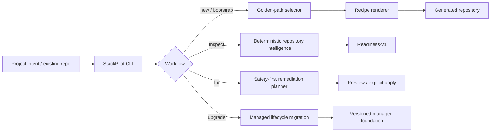
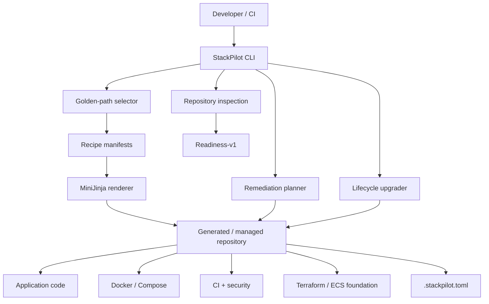

<a name="readme-top"></a>

<div align="center">


<p>
  <a href="https://github.com/gODtECH-Ctl-Create/StackPilot/actions/workflows/ci.yml"></a>
  
  
  
  
</p>

### Opinionated golden paths for building, assessing, and safely improving production-minded repositories.


<p>
  <a href="https://godtech-ctl-create.github.io/StackPilot/">Website</a> ·
  <a href="#-quick-start">Quick start</a> ·
  <a href="#-golden-paths">Golden paths</a> ·
  <a href="#-repository-engineering">Repository engineering</a> ·
  <a href="#-architecture">Architecture</a> ·
  <a href="#-ecosystem">Ecosystem</a> ·
  <a href="#-development">Development</a>
</p>

</div>

---

## ⚡ The 30-second version

**StackPilot** is a Rust-powered golden-path engine for both new and existing repositories. It scaffolds opinionated backend projects, inspects existing repositories, calculates a deterministic production-readiness score, previews safe remediation, and upgrades StackPilot-managed foundations over time.

```text
PROJECT INTENT OR EXISTING REPOSITORY
               ↓
           STACKPILOT
               ↓
   ┌───────────┼────────────┐
   ↓           ↓            ↓
SCAFFOLD    INSPECT      UPGRADE
   ↓           ↓            ↓
GOLDEN      READINESS    MANAGED
PATH        + FIX PLAN   LIFECYCLE
```

For deployable services, StackPilot defaults toward **PostgreSQL, AWS, Docker, CI, and Terraform**. Every generated backend service begins from the same contract: `/health`, port `3000`, container support, language-native CI, environment metadata, optional Terraform infrastructure, and golden-path lifecycle metadata.

> **v0.2 focus:** backend golden paths plus deterministic repository intelligence, safety-first remediation, security foundations, AWS ECS/Fargate deployment intelligence, and managed golden-path upgrades. Additional deployment targets and frontend/full-stack golden paths remain roadmap work.

<a href="#readme-top">↑ back to top</a>

---

## 🧭 Golden paths

StackPilot recommends one production-minded framework per supported backend ecosystem.

| Language | Golden path | Typical output |
| --- | --- | --- |
| 🦀 Rust | **Axum** | Backend API / service |
| 🐹 Go | **Chi** | Backend API / service |
| 🟦 TypeScript | **NestJS** | Backend API / service |
| 🐍 Python | **FastAPI** | Backend API / service |
| ☕ Java | **Spring Boot** | Backend API / service |
| 🟣 C# | **ASP.NET Core** | Backend API / service |

<p align="center">
  
</p>

The normal workflow recommends instead of overwhelming. Automation can still override supported infrastructure choices when required.

---

## 🚀 Quick start

### Install StackPilot

Linux / macOS:

```bash
curl -fsSL https://raw.githubusercontent.com/gODtECH-Ctl-Create/StackPilot/main/scripts/install.sh | sh
```

Windows PowerShell:

```powershell
irm https://raw.githubusercontent.com/gODtECH-Ctl-Create/StackPilot/main/scripts/install.ps1 | iex
```

### Create a new project

Interactive:

```bash
stackpilot new
```

Named project:

```bash
stackpilot new payment-service --recipe base
```

Preview before writing anything:

```bash
stackpilot plan payment-service \
  --non-interactive \
  --kind "Backend API" \
  --language Go \
  --framework Auto \
  --database PostgreSQL \
  --cloud AWS \
  --docker true \
  --ci true \
  --terraform true
```

Then generate the same plan:

```bash
stackpilot new payment-service \
  --recipe base \
  --non-interactive \
  --kind "Backend API" \
  --language Go \
  --framework Auto \
  --database PostgreSQL \
  --cloud AWS \
  --docker true \
  --ci true \
  --terraform true
```

### GitHub template flow

```text
01  Use this template
02  Open Actions → Configure StackPilot Template
03  Choose a language
04  Adjust infrastructure only when necessary
05  Run the workflow
06  Review the generated repository
```

For local interactive setup after cloning the template:

```bash
stackpilot bootstrap
```

Keep the engine while testing bootstrap:

```bash
stackpilot bootstrap --keep-engine
```

<a href="#readme-top">↑ back to top</a>

---

## 🧪 Repository engineering

### Inspect and score an existing repository

```bash
stackpilot inspect .
```

`inspect` is deterministic and read-only. It detects language/framework, Docker, CI/CD, Terraform, health checks, environment hygiene, security foundations, StackPilot metadata, and supported deployment signals.

The versioned **`readiness-v1`** model scores repositories out of 100 across Runtime, Delivery, Infrastructure, Security, and Operability.

Use it as a CI quality gate:

```bash
stackpilot inspect . --fail-below 80
```

### Preview safe remediation

```bash
stackpilot fix .
```

Preview is the default. Nothing is written until `--apply` is supplied:

```bash
stackpilot fix . --apply
```

Explicit options include:

```bash
stackpilot fix . --cloud AWS
stackpilot fix . --security
stackpilot fix . --deployment aws-ecs-fargate
```

StackPilot only mutates verified deterministic foundations. Ambiguous layouts are deferred instead of guessed, application changes use compare-before-write protection, and symlinked targets are refused.

### Upgrade a StackPilot-managed golden path

Preview a lifecycle migration:

```bash
stackpilot upgrade .
```

Apply it explicitly:

```bash
stackpilot upgrade . --apply
```

Golden-path versioning is independent from the `.stackpilot.toml` schema version. V0.2 introduces **golden path v2** and a deterministic migration from legacy v1 projects. The first lifecycle migration normalizes legacy metadata and brings CI-enabled StackPilot projects onto the managed V0.2 security foundation while preserving application source files.

### Security baseline

CI-enabled V0.2 golden paths include ecosystem-aware Dependabot configuration plus a hardened security workflow with dependency, secret and misconfiguration scanning, CycloneDX SBOM generation, conditional container image scanning, and explicit read-only GitHub Actions permissions.

### AWS ECS/Fargate deployment intelligence

For verified Dockerized AWS backend golden paths, `inspect` can recommend AWS ECS/Fargate. Explicit remediation can generate additive Terraform for:

- Amazon ECR
- ECS/Fargate cluster, task and service
- Application Load Balancer and target group
- IAM execution/task roles
- CloudWatch logs and container insights
- `/health` load-balancer health checks
- deployment variables and outputs

VPC and subnet topology remain explicit inputs. StackPilot generates the deployment foundation; it does not become a long-running cloud deployment control plane.

<a href="#readme-top">↑ back to top</a>

---

## 🌀 How StackPilot works



The engine stays independent from generated project languages. Recipes own stack-specific output; the Rust core owns selection, validation, rendering, repository inspection, safety, and lifecycle behavior.

---

## ✨ What you get

| Area | StackPilot provides |
| --- | --- |
| **Scaffolding** | Native Rust CLI, template bootstrap, interactive and non-interactive project generation |
| **Golden paths** | One opinionated backend framework per supported language, with deterministic recipe rendering |
| **Repository intelligence** | Read-only inspection plus versioned `readiness-v1` scoring and CI thresholds |
| **Remediation** | Preview-first deterministic fixes for env hygiene, Docker, CI, Terraform, health checks and StackPilot metadata |
| **Security** | Dependabot, dependency/secret/misconfiguration scanning, SBOM generation, container scanning and least-privilege workflow permissions |
| **Deployment** | AWS ECS/Fargate recommendation and additive Terraform deployment foundation |
| **Lifecycle** | `.stackpilot.toml`, `golden_path_version`, preview-first `stackpilot upgrade`, source-preserving managed migrations |
| **Safety** | Symlink refusal, ambiguity deferral, non-destructive previews, compare-before-write source protection |
| **Distribution** | Cross-platform release workflow, bundled recipes, checksums and installed-release smoke tests |

Supported alternatives include **MySQL, MongoDB, SQLite, or no database**, plus **Azure, GCP, or no cloud** where the recipe supports them.

<a href="#readme-top">↑ back to top</a>

---

## 🧩 Ecosystem

StackPilot, gODtECH FORGE, and gODtECH Steward are independent products with deliberately separated responsibilities.

```text
                         FORGE
               ORCHESTRATE / GOVERN / VERIFY
                            |
              +-------------+-------------+
              |                           |
              v                           v
         StackPilot                    Steward
          BUILD IT                 KEEP IT HEALTHY
              |                           |
              +-------------+-------------+
                            v
                       TARGET PROJECT
```

**StackPilot** owns project scaffolding, golden paths, stack-aware readiness/remediation, deployment foundations, and managed golden-path lifecycle upgrades.

**Steward** owns deterministic repository housekeeping, health findings, stable scan/report contracts, and conservative remediation.

**FORGE** owns AI-assisted engineering orchestration, bounded context, risk classification, approvals, resumable workflows, evidence-aware delivery, and cross-tool governance.

StackPilot can optionally consume a versioned Steward scan report as observational input. It does not copy Steward rules, invoke Steward remediation, or fold Steward health into `readiness-v1`.

FORGE may orchestrate StackPilot and Steward through their public interfaces when a workflow needs both project engineering and repository-health evidence.

> **Boundary rule:** golden-path and stack-aware semantics belong in StackPilot; generic repository housekeeping belongs in Steward; cross-product workflow and governance belong in FORGE.

See the full [ecosystem overview](./docs/ecosystem.md) and the [Steward integration contract](./docs/steward-integration.md).

<a href="#readme-top">↑ back to top</a>

---

## 🧠 Architecture



### Generated service contract

```text
/health              health endpoint
:3000                default application port
Docker               container-ready output
CI                   language-native validation/build pipeline
Security             managed baseline for CI-enabled projects
.stackpilot.toml      persisted profile + golden-path version
Terraform            optional infrastructure foundation
```

---

## 🧰 Command map

| Command | Purpose |
| --- | --- |
| `stackpilot bootstrap` | Turn the current template repository into the selected project |
| `stackpilot new` | Generate a separate project |
| `stackpilot plan` | Preview exactly what would be generated without writing files |
| `stackpilot inspect` | Inspect an existing repository and calculate `readiness-v1` |
| `stackpilot fix` | Preview or apply safe deterministic remediation |
| `stackpilot upgrade` | Preview or apply a StackPilot-managed golden-path lifecycle migration |
| `stackpilot recipes` | Discover available recipes |
| `stackpilot doctor` | Run StackPilot environment and recipe diagnostics |

---

## 📦 Installation

StackPilot release tags use semantic versioning in the form **`vMAJOR.MINOR.PATCH`**. The release workflow publishes native binaries for **Linux x86_64, macOS Intel, macOS Apple Silicon, and Windows x86_64**, plus a `SHA256SUMS` file. Release archives also contain StackPilot's recipe library, and the installer places those recipes beside the executable so commands work from any directory.

Linux / macOS installer:

```bash
curl -fsSL https://raw.githubusercontent.com/gODtECH-Ctl-Create/StackPilot/main/scripts/install.sh | sh
```

Windows PowerShell:

```powershell
irm https://raw.githubusercontent.com/gODtECH-Ctl-Create/StackPilot/main/scripts/install.ps1 | iex
```

If a tagged binary release is not yet available, run StackPilot from source:

```bash
git clone https://github.com/gODtECH-Ctl-Create/StackPilot.git
cd StackPilot
cargo run -- --help
```

Maintainers should follow the release checklist in [`docs/releasing.md`](./docs/releasing.md). A release should not be announced as installable until all expected platform archives and `SHA256SUMS` are present and the installed-release matrix is green.

See [`CHANGELOG.md`](./CHANGELOG.md) for release highlights.

---

## 🧪 Development

Before opening a pull request, run:

```bash
cargo fmt --all -- --check
cargo clippy --all-targets --all-features -- -D warnings
cargo test --all
```

StackPilot CI also validates the engine, website, all six generated golden paths, remediation adapters, security baseline, AWS ECS/Fargate foundation, and lifecycle upgrade contract.

---

## 📄 License

StackPilot is available under the **MIT License**. See [`LICENSE`](./LICENSE).

<div align="center">

**Build from a golden path. Know your readiness. Improve safely.**

<a href="#readme-top">↑ back to top</a>

</div>
