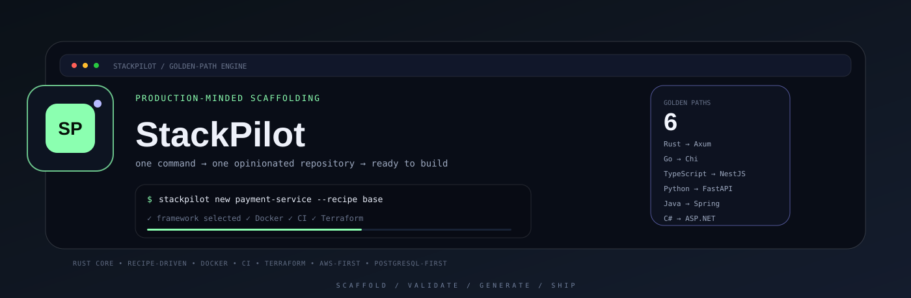
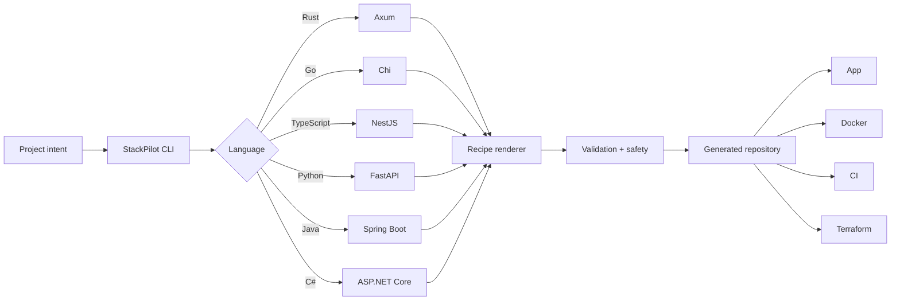
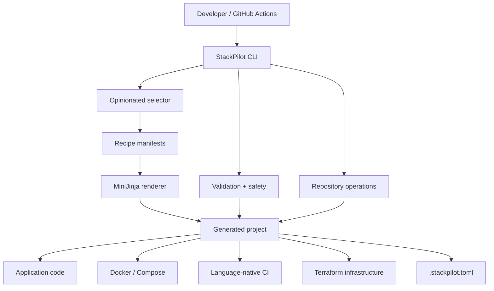

<a name="readme-top"></a>

<div align="center">



<p>
  <a href="https://github.com/gODtECH-Ctl-Create/StackPilot/actions/workflows/ci.yml"></a>
  
  
  
  
</p>

### Opinionated project scaffolding for production-minded repositories.


<p>
  <a href="https://godtech-ctl-create.github.io/StackPilot/">Website</a> ·
  <a href="#-quick-start">Quick start</a> ·
  <a href="#-golden-paths">Golden paths</a> ·
  <a href="#-architecture">Architecture</a> ·
  <a href="#-development">Development</a>
</p>

</div>

---

## ⚡ The 30-second version

**StackPilot** is a Rust-powered GitHub template and project scaffolding engine. Instead of asking you to choose from hundreds of framework combinations, it provides a deliberately opinionated **golden path** for each supported language and keeps generated repositories structurally consistent.

```text
LANGUAGE
   ↓
GOLDEN FRAMEWORK
   ↓
PRODUCTION DEFAULTS
   ↓
RECIPE + VALIDATION
   ↓
READY-TO-BUILD REPOSITORY
```

For deployable services, StackPilot defaults toward **PostgreSQL, AWS, Docker, CI, and Terraform**. Every generated backend service begins from the same contract: `/health`, port `3000`, container support, language-native CI, environment metadata, and optional Terraform infrastructure.

> **v0.1 focus:** backend services and APIs are the validated golden paths. Frontend, full-stack, workers, CLI apps, and libraries remain roadmap targets.

<a href="#readme-top">↑ back to top</a>

---

## 🧭 Golden paths

StackPilot recommends one production-minded framework per supported ecosystem.

| Language | Golden path | Typical output |
| --- | --- | --- |
| 🦀 Rust | **Axum** | Backend API / service |
| 🐹 Go | **Chi** | Backend API / service |
| 🟦 TypeScript | **NestJS** | Backend API / service |
| 🐍 Python | **FastAPI** | Backend API / service |
| ☕ Java | **Spring Boot** | Backend API / service |
| 🟣 C# | **ASP.NET Core** | Backend API / service |

<p align="center">
  
</p>

The normal workflow recommends instead of overwhelming. Automation can still override supported infrastructure choices when required.

---

## 🚀 Quick start

### GitHub template flow

The lowest-friction path is GitHub Actions:

```text
01  Use this template
02  Open Actions → Configure StackPilot Template
03  Choose a language
04  Adjust infrastructure only when necessary
05  Run the workflow
06  Review the generated repository
```

StackPilot previews the plan, generates the selected golden path, commits the result, persists the choices in `.stackpilot.toml`, and removes the template-engine source files.

For local interactive setup after cloning:

```bash
stackpilot bootstrap
```

When running directly from source:

```bash
cargo run -- bootstrap
```

Keep the engine while testing bootstrap:

```bash
stackpilot bootstrap --keep-engine
```

### Create a separate project

Interactive:

```bash
stackpilot new
```

Named project:

```bash
stackpilot new payment-service --recipe base
```

Preview before writing anything:

```bash
stackpilot plan payment-service \
  --non-interactive \
  --kind "Backend API" \
  --language Go \
  --framework Auto \
  --database PostgreSQL \
  --cloud AWS \
  --docker true \
  --ci true \
  --terraform true
```

Then generate the same plan:

```bash
stackpilot new payment-service \
  --recipe base \
  --non-interactive \
  --kind "Backend API" \
  --language Go \
  --framework Auto \
  --database PostgreSQL \
  --cloud AWS \
  --docker true \
  --ci true \
  --terraform true
```

---

## 🌀 How StackPilot works



The engine stays independent from generated project languages. Recipes own stack-specific output; the Rust core owns selection, validation, rendering, repository operations, safety, and lifecycle behavior.

---

## ✨ What you get

| Area | StackPilot provides |
| --- | --- |
| **Scaffolding** | Native Rust CLI, template bootstrap, interactive and non-interactive project generation |
| **Opinionated defaults** | `Auto` framework resolution, PostgreSQL-first database profile, AWS-first cloud profile |
| **Delivery** | Docker policy, Compose support, language-native CI, optional Terraform foundation |
| **Recipes** | TOML manifests, MiniJinja rendering, compound conditional recipe files |
| **Safety** | Non-destructive planning, path-safe generation, transactional cleanup on failure |
| **Repository lifecycle** | Git initialization, `.stackpilot.toml` project profile, template-engine cleanup |
| **Quality** | Recipe diagnostics plus CI compatibility coverage across every golden path |
| **Distribution** | Cross-platform release workflow and one-command installer scripts |

Supported alternatives include **MySQL, MongoDB, SQLite, or no database**, plus **Azure, GCP, or no cloud** where the recipe supports them.

---

## 🧠 Architecture



### Generated service contract

```text
/health              health endpoint
:3000                default application port
Docker               container-ready output
CI                   language-native validation/build pipeline
.stackpilot.toml      persisted project profile
Terraform            optional infrastructure foundation
```

---

## 🧰 Command map

| Command | Purpose |
| --- | --- |
| `stackpilot bootstrap` | Turn the current template repository into the selected project |
| `stackpilot new` | Generate a separate project |
| `stackpilot plan` | Preview exactly what would be generated without writing files |
| `stackpilot recipes` | Discover available recipes |
| `stackpilot doctor` | Run StackPilot diagnostics |

---

## 📦 Installation

Tagged releases are configured to publish native binaries for **Linux x86_64, macOS Intel, macOS Apple Silicon, and Windows x86_64**.

Linux / macOS installer:

```bash
curl -fsSL https://raw.githubusercontent.com/gODtECH-Ctl-Create/StackPilot/main/scripts/install.sh | sh
```

Windows PowerShell:

```powershell
irm https://raw.githubusercontent.com/gODtECH-Ctl-Create/StackPilot/main/scripts/install.ps1 | iex
```

If a tagged binary release is not yet available, run StackPilot from source:

```bash
git clone https://github.com/gODtECH-Ctl-Create/StackPilot.git
cd StackPilot
cargo run -- --help
```

---

## 🧪 Development

Before opening a pull request, run:

```bash
cargo fmt --all -- --check
cargo clippy --all-targets --all-features -- -D warnings
cargo test --all
```

StackPilot's CI also validates that every supported golden path can be generated and built consistently.

---

## 📄 License

StackPilot is available under the **MIT License**. See [`LICENSE`](./LICENSE).

<div align="center">

**Build from a golden path. Spend your time on the product.**

<a href="#readme-top">↑ back to top</a>

</div>
